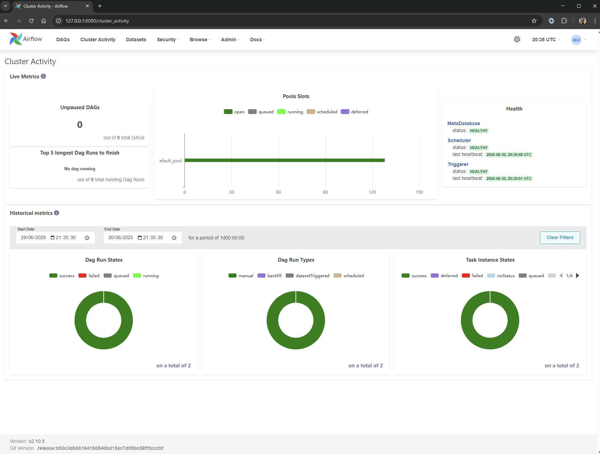
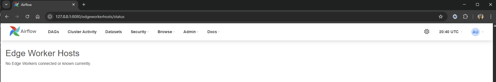
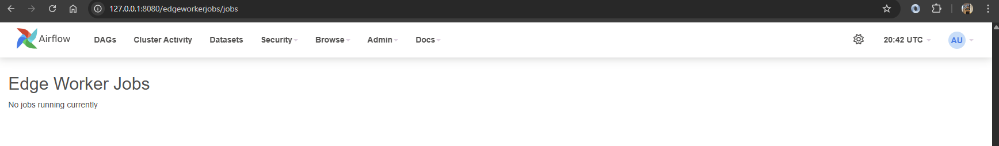
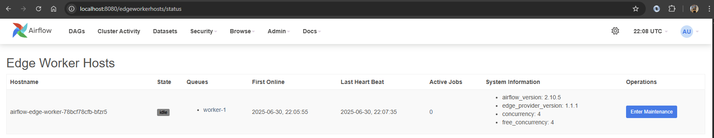
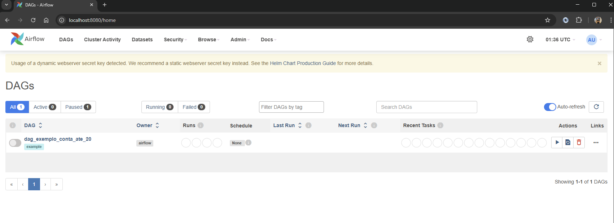
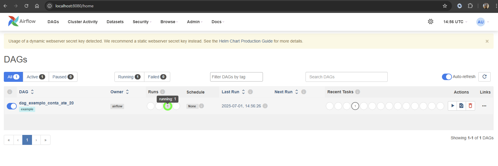
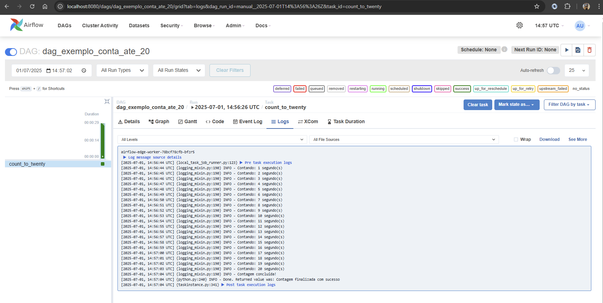
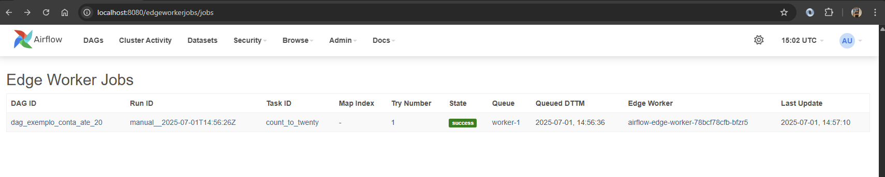

# Airflow Edge Executor: Executando DAGs em Agentes de Borda

Recentemente, precisei encontrar uma forma de executar minhas cargas de trabalho em recursos fora da infraestrutura principal do meu Airflow. Os motivos são vários, mas um dos principais é a necessidade de executar DAGs em infraestruturas remotas, em diferentes locais do mundo, às vezes para reduzir a latência das conexões com as fontes de dados.

Existem muitas abordagens que podem ser utilizadas para conseguir esse mesmo resultado, como, por exemplo, criar uma instância do Airflow para cada região. No entanto, o esforço pode não compensar, especialmente quando estamos falando de poucas DAGs que serão executadas nessas bordas.

Foi então que encontrei o provedor [Edge3](https://airflow.apache.org/docs/apache-airflow-providers-edge3/1.1.1/index.html). Trata-se de um executor que permite executar cargas de trabalho em agentes remotos, e é o que vou utilizar neste artigo. Demonstrarei como fiz a configuração local usando o Kind (Kubernetes in Docker).

> **Nota:** Este tutorial foi executado localmente em um ambiente não produtivo. O exemplo servirá apenas para demonstração de como o provedor funciona.

Se você tem pouca familiaridade com o Apache Airflow, antes de começar, pode aprender mais no site da [Astronomer](https://www.astronomer.io/docs/learn/intro-to-airflow/).

Este artigo se baseia no Airflow 2.10.5, pois com ele consigo mostrar o fluxo completo do processo e também a UI. Para o Airflow 3, a UI correspondente está aguardando o desenvolvimento do [AIP-68](https://github.com/apache/airflow/issues/42702). Assim que estiver disponível, posso atualizar este artigo com a nova versão.

## Requisitos:

 * [Kind](https://kind.sigs.k8s.io/docs/)
 * [Kubectl](https://kubernetes.io/docs/tasks/tools/)
 * [Docker](https://docs.docker.com/) ou [ContainerD](https://containerd.io/docs/)
 * [Helm](https://helm.sh/docs/)

Neste artigo, vamos seguir os seguintes passos:

*   Configurar um cluster Kubernetes local com o Kind.
*   Instalar o Airflow via Helm Chart em nosso cluster.
*   Configurar o Edge Executor para se comunicar com agentes remotos.
*   Criar e executar uma DAG de exemplo em um agente de borda.

## Setup do Kind

Iremos criar um novo cluster Kubernetes usando o Kind. Para isso, usarei um arquivo de configuração para preparar o cluster conforme nossas necessidades.

Crie um arquivo `config.yaml` com os valores abaixo:

> **Dica:** O `hostPath` deve ser o caminho absoluto para a pasta onde você está trabalhando. Recomendo que você crie uma pasta específica para as DAGs. Este mapeamento permite que o Airflow, rodando dentro do cluster Kind, acesse os arquivos de DAGs da sua máquina local. Você também pode usar o Git-Sync como alternativa, conforme detalhado na [documentação do Helm Chart](https://airflow.apache.org/docs/helm-chart/1.7.0/manage-dags-files.html).

Iremos mapear a sua pasta local para um caminho dentro dos nós do Kubernetes. Dessa forma, o Airflow conseguirá encontrar seus arquivos. Posteriormente, criaremos um PersistentVolume usando essa mesma pasta.

```yaml
kind: Cluster
apiVersion: kind.x-k8s.io/v1alpha4
nodes:
- role: control-plane
  extraMounts:
  - containerPath: /airflow/local/dags
    hostPath:  /home/username/airflow/dags # Lembre-se de alterar para o seu caminho
    readOnly: true
- role: edge-worker
  extraMounts:
  - containerPath: /airflow/local/dags
    hostPath:  /home/username/airflow/dags # Lembre-se de alterar para o seu caminho
    readOnly: true
- role: airflow
  extraMounts:
  - containerPath: /airflow/local/dags
    hostPath:  /home/username/airflow/dags # Lembre-se de alterar para o seu caminho
    readOnly: true

```
Agora, vamos criar nosso cluster usando o comando abaixo:

```shell
kind create cluster --name airflow  --config=config.yaml
```
```
rehzende@rehzendepc:/home/rehzende/airflow/edge_poc/kind$ kind create cluster --name airflow  --config=config.yaml
Creating cluster "airflow" ...
 ✓ Ensuring node image (kindest/node:v1.25.3) 🖼 
 ✓ Preparing nodes 📦 📦 📦  
 ✓ Writing configuration 📜 
 ✓ Starting control-plane 🕹️ 
 ✓ Installing CNI 🔌 
 ✓ Installing StorageClass 💾 
 ✓ Joining worker nodes 🚜 
Set kubectl context to "kind-airflow"
You can now use your cluster with:

kubectl cluster-info --context kind-airflow

Have a nice day! 👋
```

## Criando um Contêiner para o Airflow

Com seu cluster criado, vamos preparar o contêiner do Airflow com as dependências que precisamos.

O Airflow já disponibiliza imagens no Docker Hub para cada versão, porém, elas não vêm com o provedor Edge instalado por padrão. Para isso, iremos criar um novo contêiner baseado na imagem oficial.

Crie um novo arquivo `Dockerfile` com o conteúdo abaixo:

```Dockerfile
FROM apache/airflow:2.10.5

# Mudar para usuário root para instalar dependências
USER root

RUN apt-get update && apt-get install -y \
    curl \
    && rm -rf /var/lib/apt/lists/*

USER airflow

RUN pip install --no-cache-dir apache-airflow-providers-edge3 apache-airflow==2.10.5

EXPOSE 8080
```
Agora, vamos construir nossa imagem. Use o comando abaixo:

```shell
docker build -t airflow:2.10.5-edge .
```
> **Dica:** Garanta que você está executando esse comando no mesmo diretório onde o `Dockerfile` foi criado.

## Carregando a imagem no Kind

O Kind não tem acesso direto às suas imagens Docker locais. Por isso, precisamos carregá-la para dentro do cluster. Para isso, basta executar o comando abaixo:

```shell
kind load docker-image airflow:2.10.5-edge --name airflow
```
O comando acima irá carregar a imagem para todos os nós dentro do cluster `airflow`.

## Instalando o Airflow via Helm

Iremos usar o Helm Chart para provisionar o Airflow, pois, na minha opinião, é o melhor caminho e se assemelha muito a um processo produtivo.

Mais informações sobre o Helm Chart do Airflow você pode encontrar na [documentação oficial](https://airflow.apache.org/docs/helm-chart/1.7.0/index.html). O EdgeExecutor está disponível para uso a partir da versão `1.17.0` do chart.

Adicione o repositório do Airflow com este comando:

```shell
helm repo add apache-airflow https://airflow.apache.org
```

Vamos criar um arquivo `values.yaml` para personalizar alguns parâmetros do Airflow.

```yaml
executor: airflow.providers.edge3.executors.EdgeExecutor


# defaultAirflowRepository: apache/airflow
defaultAirflowTag: 2.10.5
defaultAirflowDigest: ~
airflowVersion: 2.10.5

exampleDag: true

images:
  airflow:
    repository: airflow
    tag: "2.10.5-edge"

# Habilita as variáveis de ambiente necessárias para JWT
enableBuiltInSecretEnvVars:
  AIRFLOW__CORE__FERNET_KEY: true
  AIRFLOW__DATABASE__SQL_ALCHEMY_CONN: true
  AIRFLOW_CONN_AIRFLOW_DB: true
  AIRFLOW__WEBSERVER__SECRET_KEY: true
  AIRFLOW__API_AUTH__JWT_SECRET: true

config:
  core: 
    # Dica de Segurança: Em produção, gere uma chave segura e armazene-a em um secret do Kubernetes.
    # Ex: openssl rand -hex 32
    internal_api_secret_key: "MmEwYmQ1MWFlYWY4MjA2MGFhZGY0NzY5YmIyMjkzZGE"

  webserver:
    expose_config: 'True'

  api:
    auth_backends: 'airflow.api.auth.backend.basic_auth,airflow.api.auth.backend.session'
  
  edge:
    api_enabled: 'True'
    api_url: 'http://{{ include "airflow.fullname" . }}-webserver:8080/edge_worker/v1/rpcapi'
    heartbeat_interval: 30
    job_poll_interval: 5
    push_logs_enabled: 'True'
    worker_register_retry_attempts: 3
    worker_register_retry_delay: 10

dags:
  mountPath: /opt/airflow/dags
  persistence:
    enabled: true
    # Dica: Este é o nome do PersistentVolumeClaim que criaremos a seguir.
    existingClaim: airflow-dags-claim

```

Explicando cada seção:

*   **`executor`**: Define o executor que o Airflow usará. Aqui, configuramos para `airflow.providers.edge3.executors.EdgeExecutor`, que permite a execução de tarefas em agentes remotos (de borda).

*   **`defaultAirflowTag` e `airflowVersion`**: Especificam a versão do Airflow que queremos usar, neste caso, `2.10.5`.

*   **`images`**: Esta seção define a imagem Docker a ser usada para os componentes do Airflow.
    *   `repository`: `airflow` - O nome da imagem que construímos anteriormente.
    *   `tag`: `"2.10.5-edge"` - A tag da nossa imagem customizada que inclui o provedor `edge3`.

*   **`enableBuiltInSecretEnvVars`**: O Helm Chart pode criar segredos do Kubernetes para configurações sensíveis do Airflow. Habilitamos a criação automática para:
    *   `AIRFLOW__CORE__FERNET_KEY`: Chave de criptografia para senhas de conexão.
    *   `AIRFLOW__DATABASE__SQL_ALCHEMY_CONN`: A string de conexão com o banco de dados do Airflow.
    *   `AIRFLOW_CONN_AIRFLOW_DB`: A conexão com o banco de dados do Airflow, disponibilizada como uma conexão do Airflow.
    *   `AIRFLOW__WEBSERVER__SECRET_KEY`: Chave secreta para a sessão do webserver.
    *   `AIRFLOW__API_AUTH__JWT_SECRET`: Chave secreta para assinar tokens JWT para a API.

*   **`config`**: Permite definir configurações que normalmente estariam no arquivo `airflow.cfg`.
    *   **`core`**:
        *   `internal_api_secret_key`: Uma chave secreta usada para proteger a API interna entre os componentes do Airflow.
    *   **`webserver`**:
        *   `expose_config`: `'True'` - Expõe a configuração do Airflow na UI, útil para depuração.
    *   **`api`**:
        *   `auth_backends`: Define os métodos de autenticação para a API REST. Usamos a autenticação básica e a baseada em sessão.
    *   **`edge`**: Configurações específicas para o `EdgeExecutor`.
        *   `api_enabled`: `'True'` - Habilita o endpoint da API no webserver para que os workers de borda possam se comunicar.
        *   `api_url`: A URL que os workers usarão para se registrar e obter tarefas. O template `{{ include "airflow.fullname" . }}` é preenchido pelo Helm com o nome da release.
        *   `heartbeat_interval`: Intervalo (em segundos) que os workers enviam um sinal de "estou vivo".
        *   `job_poll_interval`: Intervalo (em segundos) que os workers verificam se há novas tarefas para executar.
        *   `push_logs_enabled`: `'True'` - Faz com que os workers enviem os logs das tarefas de volta para o Airflow.
        *   `worker_register_retry_attempts`: Número de tentativas de registro do worker caso a primeira falhe.
        *   `worker_register_retry_delay`: Tempo de espera (em segundos) entre as tentativas de registro.

*   **`dags`**: Configura como as DAGs são carregadas.
    *   `mountPath`: O caminho dentro dos contêineres do Airflow onde as DAGs estarão disponíveis.
    *   `persistence`: Configura o uso de um volume persistente para as DAGs.
        *   `enabled`: `true` - Habilita o uso de armazenamento persistente.
        *   `existingClaim`: `airflow-dags-claim` - Especifica o nome de um `PersistentVolumeClaim` (PVC) existente que usaremos para montar as DAGs. Precisaremos criar este PVC.

Você vai precisar criar um PersistentVolume e um PersistentVolumeClaim. Use o manifesto abaixo.

```yaml
kind: PersistentVolumeClaim
apiVersion: v1
metadata:
  name: airflow-dags-claim
  namespace: airflow
spec:
  accessModes:
    - ReadWriteMany
  resources:
    requests:
      storage: 2Gi
  volumeName: airflow-dags
  storageClassName: standard
  volumeMode: Filesystem

---

kind: PersistentVolume
apiVersion: v1
metadata:
  name: airflow-dags
spec:
  capacity:
    storage: 2Gi
  hostPath:
    path:  /airflow/local/dags
  accessModes:
    - ReadWriteMany
  persistentVolumeReclaimPolicy: Retain
  storageClassName: standard

```
Crie um arquivo `pv-pvc.yaml` e faça o deploy:

```shell
kubectl apply -f "pv-pvc.yaml" -n airflow
```

Agora, iremos realizar o deploy do Airflow:

```shell
helm upgrade --install airflow apache-airflow/airflow --version 1.17.0 --values ./values.yaml --namespace airflow --create-namespace
```
O comando acima irá criar uma release com o nome `airflow`, usando o repositório `apache-airflow/airflow` na versão `1.17.0`, no namespace `airflow`. A flag `--create-namespace` cria o namespace caso ele não exista.

Você pode expor o portal do Webserver usando o comando abaixo:
```shell
kubectl port-forward svc/airflow-webserver 8080:8080 --namespace airflow
```

> **Usuário:** `admin` \
> **Senha:** `admin`



Com seu Airflow executando localmente, você pode verificar os menus `Admin > Edge Worker Hosts` e `Admin > Edge Worker Jobs`.

**Edge Worker Hosts**



**Edge Worker Jobs**



Obviamente, ambos estão vazios. Agora, vamos subir um Edge Worker. Vou mostrar um exemplo usando um Deployment do Kubernetes.

Vamos criar um arquivo `worker-1.yaml` com o conteúdo abaixo:

```yaml
apiVersion: apps/v1
kind: Deployment
metadata:
  name: airflow-edge-worker
  namespace: airflow
  labels:
    app: airflow-edge-worker
spec:
  replicas: 1
  selector:
    matchLabels:
      app: airflow-edge-worker
  template:
    metadata:
      labels:
        app: airflow-edge-worker
    spec:
      containers:
      - name: worker
        image: airflow:2.10.5-edge
        imagePullPolicy: IfNotPresent
        command: ["airflow", "edge", "worker"]
        args: ["--concurrency", "4", "--queue", "worker-1"]
        env:
        - name: AIRFLOW__CORE__EXECUTOR
          value: airflow.providers.edge3.executors.edge_executor.EdgeExecutor
        - name: AIRFLOW__CORE__INTERNAL_API_SECRET_KEY
          value: MmEwYmQ1MWFlYWY4MjA2MGFhZGY0NzY5YmIyMjkzZGE
        
        # Configurações do Edge Worker
        - name: AIRFLOW__EDGE__API_ENABLED
          value: "True"
        - name: AIRFLOW__EDGE__API_URL
          value: http://airflow-webserver:8080/edge_worker/v1/rpcapi
        - name: AIRFLOW__EDGE__WORKER_CONCURRENCY
          value: "4"
        - name: AIRFLOW__EDGE__HEARTBEAT_INTERVAL
          value: "10"
        - name: AIRFLOW__EDGE__JOB_POLL_INTERVAL
          value: "5"
        
        resources:
          requests:
            memory: "512Mi"
            cpu: "250m"
          limits:
            memory: "1Gi"
            cpu: "500m"
        volumeMounts:
        - name: dags
          mountPath: /opt/airflow/dags
      volumes:
      - name: dags
        persistentVolumeClaim:
          claimName: airflow-dags-claim

```

Aplique o manifesto usando o comando abaixo:
```
kubectl apply -f worker-1.yaml -n airflow
```

Você pode conferir o status do pod com o comando abaixo:

```shell
$ kubectl get pods -n airflow -l app=airflow-edge-worker
NAME                                   READY   STATUS    RESTARTS   AGE
airflow-edge-worker-78bcf78cfb-bfzr5   1/1     Running   0          9s
```

No portal, você pode verificar o status do worker:



O hostname do worker é o mesmo nome do Pod do Kubernetes. Nosso deployment, neste momento, está executando com apenas 1 réplica, mas podemos escalar para mais réplicas, o que faremos em breve.

O worker está rodando e aguardando trabalhos de uma fila. Essa fila corresponde ao nome de um ou mais [Pools](https://airflow.apache.org/docs/apache-airflow/stable/administration-and-deployment/pools.html) do Airflow. **O nome do pool e da queue devem ser iguais ao configurado no worker** para que as tasks sejam direcionadas corretamente. Neste momento, temos apenas o `default_pool`. Para direcionar tarefas para nosso novo worker, iremos criar um novo pool chamado `worker-1`.

> **Dica:** Você também pode criar o Pool diretamente na UI do Airflow, em `Admin > Pools`. O mesmo vale para pausar/despausar DAGs e executar manualmente, que pode ser feito tanto pela UI quanto pela API.

```shell
curl -X 'POST' \
  'http://localhost:8080/api/v1/pools' \
  -H 'accept: application/json' \
  -H 'Content-Type: application/json' \
  --user "admin:admin" \
  -d '{
  "description": "Edge Pool",
  "include_deferred": false,
  "name": "worker-1",
  "slots": 10
}'
```

Agora que temos um pool e um worker criados, vamos criar uma nova [DAG](https://airflow.apache.org/docs/apache-airflow/2.10.5/core-concepts/dags.html). A DAG será simples, apenas para demonstrar o funcionamento.
 

Crie um arquivo dentro de `/home/username/airflow/dags` # Lembre-se de alterar para o seu caminho real.

```python
# dag_exemplo.py

import os
import time
import pendulum

from airflow import DAG
from airflow.decorators import task
from airflow.settings import AIRFLOW_HOME

with DAG(
    dag_id="dag_exemplo_conta_ate_20",
    schedule=None,
    start_date=pendulum.datetime(2021, 1, 1, tz="UTC"),
    catchup=False,
    tags=["example"]
   
) as dag:

    @task(pool="worker-1", queue="worker-1")
    def count_to_twenty():
        """Task que conta até 20 segundos"""
        for i in range(1, 21):
            print(f"Contando: {i} segundo(s)")
            time.sleep(1)
        print("Contagem concluída!")
        return "Contagem finalizada com sucesso"

    count_to_twenty()

```

Ao salvar a dag na pasta correta, o Airflow irá processar o arquivo e salvar no banco de dados. Você pode entender melhor como funciona na [documentação](https://airflow.apache.org/docs/apache-airflow/2.10.5/administration-and-deployment/dag-serialization.html).

Sua dag deve aparece na UI como o exemplo abaixo:



A dag irá aparecer pausada, para rodar a dag você precisa despausar e executar.  
Você pode fazer isso pela UI (clicando no botão de "play" e depois em "Trigger DAG") ou executar os comandos abaixo:

```bash
NOW=$(date -u +"%Y-%m-%dT%H:%M:%SZ")
curl -X 'PATCH' \
  'http://localhost:8080/api/v1/dags/dag_exemplo_conta_ate_20' \
  -H 'accept: application/json' \
  -H 'Content-Type: application/json' \
  --user "admin:admin" \
  -d '{"is_paused": false}'

curl -X 'POST' \
  'http://localhost:8080/api/v1/dags/dag_exemplo_conta_ate_20/dagRuns' \
  -H 'accept: application/json' \
  -H 'Content-Type: application/json' \
  --user "admin:admin" \
  -d "{
  \"conf\": {},
  \"dag_run_id\": \"manual__${NOW}\",
  \"data_interval_start\": \"${NOW}\",
  \"data_interval_end\": \"${NOW}\",
  \"logical_date\": \"${NOW}\",
  \"note\": \"Execução manual dinâmica\"
}"
```







A dag executou com sucesso, mas será que executou no Edge Worker?


Se olharmos na aba `Admin >  Edge Worker Jobs` 




Se olharmos os logs do Edge Worker Agent veremos essas informçãoes que mostra o momento que a task foi executada e finalizada.


```log
[airflow-edge-worker-78bcf78cfb-bfzr5] 2025-07-01T14:56:25.097687255Z [2025-07-01T14:56:25.097+0000] {worker.py:318} INFO - No new job to process
[airflow-edge-worker-78bcf78cfb-bfzr5] 2025-07-01T14:56:30.130897868Z [2025-07-01T14:56:30.130+0000] {worker.py:318} INFO - No new job to process
[airflow-edge-worker-78bcf78cfb-bfzr5] 2025-07-01T14:56:35.149897972Z [2025-07-01T14:56:35.149+0000] {worker.py:318} INFO - No new job to process
[airflow-edge-worker-78bcf78cfb-bfzr5] 2025-07-01T14:56:40.186057480Z [2025-07-01T14:56:40.185+0000] {worker.py:313} INFO - Received job: dag_id='dag_exemplo_conta_ate_20' task_id='count_to_twenty' run_id='manual__2025-07-01T14:56:26Z' map_index=-1 try_number=1 command=['airflow', 'tasks', 'run', 'dag_exemplo_conta_ate_20', 'count_to_twenty', 'manual__2025-07-01T14:56:26Z', '--local', '--subdir', 'DAGS_FOLDER/dag_exemplo.py'] concurrency_slots=1
[airflow-edge-worker-78bcf78cfb-bfzr5] 2025-07-01T14:56:40.225662760Z [2025-07-01T14:56:40.225+0000] {worker.py:318} INFO - No new job to process, 1 still running
[airflow-edge-worker-78bcf78cfb-bfzr5] 2025-07-01T14:56:43.726008408Z [2025-07-01T14:56:43.724+0000] {internal_api_call.py:90} INFO - DB isolation mode. Using internal_api when running run.
[airflow-edge-worker-78bcf78cfb-bfzr5] 2025-07-01T14:56:43.726368604Z [2025-07-01T14:56:43.725+0000] {settings.py:505} INFO - Forcing TracebackSession for untrusted components.
[airflow-edge-worker-78bcf78cfb-bfzr5] 2025-07-01T14:56:44.500215306Z [2025-07-01T14:56:44.499+0000] {dagbag.py:588} INFO - Filling up the DagBag from /opt/airflow/dags/dag_exemplo.py
[airflow-edge-worker-78bcf78cfb-bfzr5] 2025-07-01T14:56:44.584495330Z [2025-07-01T14:56:44.583+0000] {task_command.py:467} INFO - Running task_id='count_to_twenty' dag_id='dag_exemplo_conta_ate_20' run_id='manual__2025-07-01T14:56:26Z' map_index=-1 start_date=None end_date=None execution_date=datetime.datetime(2025, 7, 1, 14, 56, 26, tzinfo=TzInfo(UTC)) duration=None state='queued' try_number=1 max_tries=0 hostname='' unixname='airflow' job_id=None pool='worker-1' pool_slots=1 queue='worker-1' priority_weight=1 operator='_PythonDecoratedOperator' custom_operator_name='@task' queued_dttm=datetime.datetime(2025, 7, 1, 14, 56, 36, 29385, tzinfo=TzInfo(UTC)) queued_by_job_id=6 pid=None executor=None executor_config={} updated_at=datetime.datetime(2025, 7, 1, 14, 56, 36, 29637, tzinfo=TzInfo(UTC)) rendered_map_index=None external_executor_id=None trigger_id=None trigger_timeout=None next_method=None next_kwargs=None run_as_user=None task=<Task(_PythonDecoratedOperator): count_to_twenty> test_mode=False dag_run=DagRunPydantic(id=8, dag_id='dag_exemplo_conta_ate_20', queued_at=datetime.datetime(2025, 7, 1, 14, 56, 35, 386060, tzinfo=TzInfo(UTC)), execution_date=datetime.datetime(2025, 7, 1, 14, 56, 26, tzinfo=TzInfo(UTC)), start_date=datetime.datetime(2025, 7, 1, 14, 56, 36, 13699, tzinfo=TzInfo(UTC)), end_date=None, state='running', run_id='manual__2025-07-01T14:56:26Z', creating_job_id=None, external_trigger=True, run_type='manual', conf={}, data_interval_start=datetime.datetime(2025, 7, 1, 14, 56, 26, tzinfo=TzInfo(UTC)), data_interval_end=datetime.datetime(2025, 7, 1, 14, 56, 26, tzinfo=TzInfo(UTC)), last_scheduling_decision=datetime.datetime(2025, 7, 1, 14, 56, 44, 27266, tzinfo=TzInfo(UTC)), dag_hash='f214d7ad2415bc4190e0bd77f9c6deb2', updated_at=datetime.datetime(2025, 7, 1, 14, 56, 44, 31108, tzinfo=TzInfo(UTC)), dag=None, consumed_dataset_events=[], log_template_id=1) dag_model=DagModelPydantic(dag_id='dag_exemplo_conta_ate_20', root_dag_id=None, is_paused_at_creation=True, is_paused=False, is_subdag=False, is_active=True, last_parsed_time=datetime.[airflow-edge-worker-78bcf78cfb-bfzr5] 2025-07-01T14:56:45.304653086Z [2025-07-01T14:56:45.304+0000] {worker.py:318} INFO - No new job to process, 1 still running
[airflow-edge-worker-78bcf78cfb-bfzr5] 2025-07-01T14:56:50.351338340Z [2025-07-01T14:56:50.350+0000] {worker.py:318} INFO - No new job to process, 1 still running
[airflow-edge-worker-78bcf78cfb-bfzr5] 2025-07-01T14:56:55.386304118Z [2025-07-01T14:56:55.385+0000] {worker.py:318} INFO - No new job to process, 1 still running

```

## Resumo e próximos passos

Com este tutorial, você aprendeu como:

- Configurar um cluster Kubernetes local com Kind.
- Customizar e carregar uma imagem do Airflow com o provedor Edge3.
- Instalar o Airflow via Helm e configurar o Edge Executor.
- Criar pools e workers dedicados para execução em borda.
- Criar e executar DAGs direcionadas para agentes remotos.

**Próximos passos sugeridos:**

- Explorar a escalabilidade criando múltiplos Edge Workers e pools.
- Testar DAGs mais complexas e monitorar logs e métricas.
- Integrar com fontes de dados remotas para validar ganhos de latência.
- Avaliar segurança e uso de secrets para ambientes produtivos.

Se tiver dúvidas ou sugestões, fique à vontade para comentar ou contribuir!

